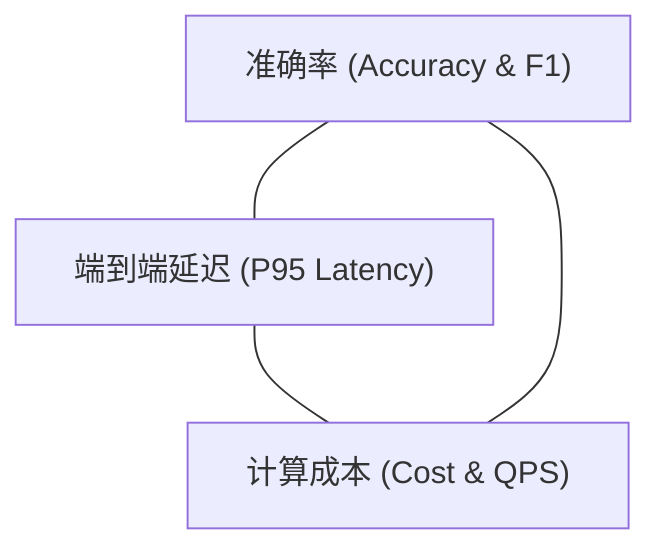
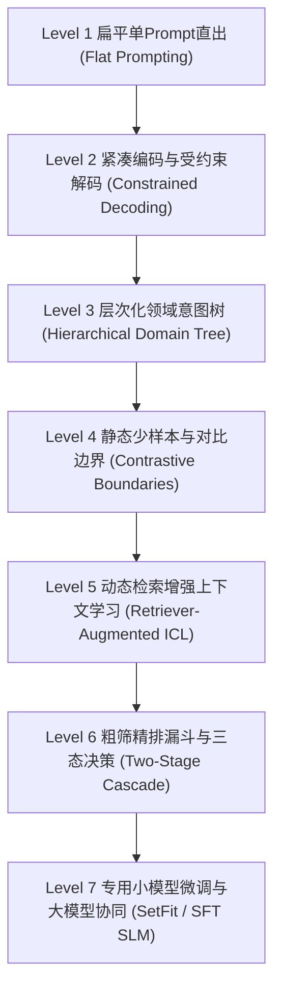
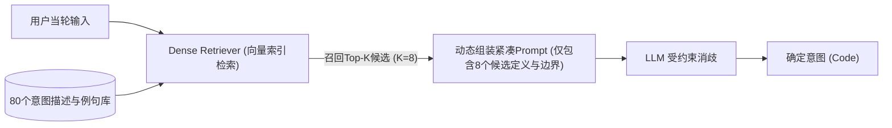
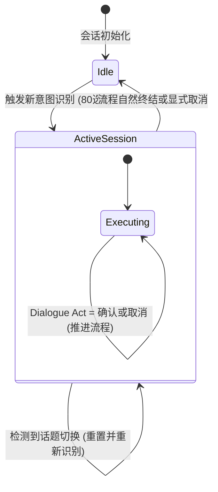
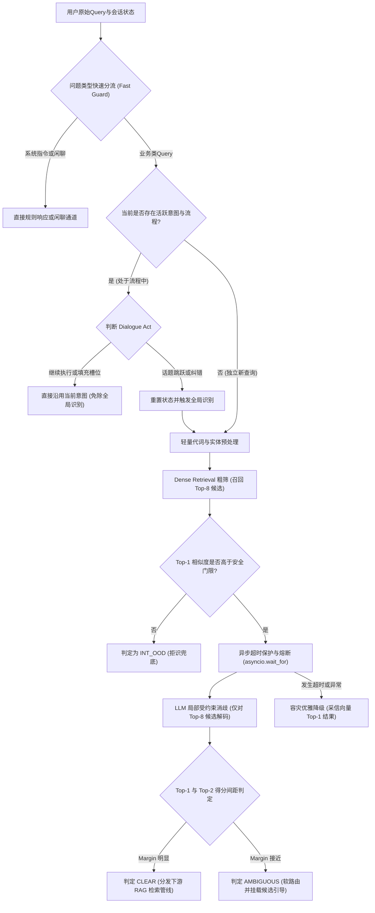

# 大模型时代对话意图识别全景实践：从80个细粒度小类到生产级架构演进

意图识别（Intent Classification / Routing）是现代智能对话助手、检索增强生成（RAG）管道以及 Multi-Agent 编排框架的第一道门禁。系统的路由判断直接决定了后续是分发给特定的专业 RAG 检索管线、执行确定性工具，还是引导用户澄清或拒识。

本文聚焦于**纯分类型意图识别**——即输入用户当前轮次的自然语言查询（可结合会话上下文），判定其归属于预设闭集中的哪一个意图类别，不涉及槽位抽取（Slot Filling）、参数实体解析与复杂的 API 编排。以典型的垂直领域 RAG 对话助手为例，系统通常需要将用户提问精准划分至 **80 个左右细粒度小类** 中的一个。

本文结合学术界权威基准（如 Banking77、CLINC150）、前沿研究成果（EMNLP、ACL、SIGDIAL），并深度参考知名前沿 Agent 项目（Cursor、Claude Code、DeerFlow、DeepAgents）的系统架构哲学，系统梳理大模型时代对话意图识别的机理演进、权衡边界与生产级落地实践。

---

## 一、引言与问题本质：80 个细粒度小类的分类困局

### 1.1 任务边界界定

在开始系统设计前，必须严谨界定任务输入与输出的边界：

```text
输入 (Input)：用户当轮 Query（可附加滑动窗口内的上下文历史或解析实体）
输出 (Output)：Intent_Code ∈ {INT_01, INT_02, ..., INT_80} ∪ {INT_OOD}
```

- **任务核心**：解决语义映射与分发（Routing），保证高召回与高准确。
- **解耦边界**：不将「参数抽取」（如提取手机号、金额、时间周期）与「意图路由」强行耦合在同一个 Prompt 中。解耦不仅能降低单次模型的推理负担，也使得意图分类器能够专门优化判别能力。

### 1.2 通俗心智模型：为什么 80 个细粒度小类是工程硬骨头？

我们可以用一个通俗的现实场景做类比：
- **粗粒度分类（5~10 类）** 就像让服务员判断顾客要吃「川菜、粤菜、西餐还是面食」。菜系之间特征鲜明、词汇正交，普通模型凭借少量关键词即可轻松分流。
- **细粒度分类（80 类）** 相当于菜单上有「微辣鲜椒沸腾鱼」、「微麻老坛酸菜鱼」、「重辣水煮鱼片」等数十种极其相似的菜品。顾客口语化地表达「来份带辣味的鱼」，不同类别之间的语义边界高度重叠。

在 80 个细粒度意图的场景下，若采用最朴素的大模型直出方案，通常会面临三大本质瓶颈：
1. **长上下文注意力稀释**：80 个意图的说明文档与边界说明轻易占用数千 Token。根据 Liu 等人在《Lost in the Middle》中的实验发现，大语言模型对长上下文处于中间位置的信息敏感度显著下降，容易导致相近类别的注意力漂移。
2. **生成阶段的时延惩罚**：让大模型自由生成自然语言解释与意图名称，会占用过多的输出 Token（Decode Phase），造成端到端响应时延大幅上升。
3. **近邻语义混淆**：许多业务小类字面极其相似（例如「政策条文咨询」vs「业务办理流程」），用户表达往往高度口语化、口语省略或带有隐喻，常规提示难以激发模型做出精细判别。

### 1.3 映射学术标杆：Banking77 与 CLINC150 的启示

学术界很早便开始关注细粒度意图识别的挑战：
- **[Banking77](https://huggingface.co/datasets/PolyAI/banking77)**：收录了银行客服领域的 77 个细粒度意图，各类别间语义高度重叠（例如 `card_arrival` 与 `card_delivery_estimate`），专门用于评估模型在密集标签空间中的小样本与细粒度区分能力。
- **[CLINC150](https://huggingface.co/datasets/clinc_oos)**：涵盖 10 个业务领域的 150 个意图，并专门引入了域外（Out-of-Scope, OOS）样本集，用于衡量模型在海量类别下的分类及拒识能力。

来自公开基准论文（如 Casanueva 等人的基准评估、EMNLP 2024 Industry 的《Intent Detection in the Age of LLMs》）的实验揭示了一个重要事实：**在数十个细粒度类别上，单纯依靠通用大模型的 Few-Shot 提示，分类性能并不天然优于经过对比学习微调的专用判别模型；且由于上下文过长，大模型的首字延迟（TTFT）与推理算力成本成倍增长**。因此，生产环境的工程目标并不是让单个大模型承担所有识别工作，而是构建多层次分流架构。

### 1.4 工业落地的指标三角

在真实的对话助手与 Agent 系统中，意图识别必须在以下三个指标间取得平衡：



- **Accuracy**：不仅看全局 Micro-F1，更要关注高频混淆对（Confusing Pairs）的隔离度以及对非业务 query 的拒识 F1。
- **Latency**：在流式输出的对话场景下，意图识别属于前置阻塞调用。若意图判断耗时超过 1 秒，整体体验就会产生卡顿感。
- **Cost**：如果每次用户交互都需要向商业 API 传入包含 80 个意图定义的超长 Prompt，高并发下的 Token 账单将难以维系。

### 1.5 认知范式：从 System 2 连续文本生成到 System 1 离散闭集合决策

探讨意图识别的工程瓶颈，必须回归第一性原理：**为什么我们要用一个擅长「写作文」的生成式聊天模型，来做本质上属于「选选项」的程序控制流路由？**

借用诺贝尔奖得主丹尼尔·卡尼曼在《思考，快与慢》中的经典框架：
- **System 2（慢思考/慢推理）**：代表深思熟虑、逻辑严密的长链连续推理（如复杂代码架构设计、长篇研报生成、多步工具规划）。主流的大语言模型（如 GPT-4、Claude、Gemini）本质上皆面向 System 2 的文本生成进行预训练与人类偏好对齐（RLHF）。
- **System 1（快思考/直觉决策）**：代表毫秒级的模式匹配与离散判断（如一眼判断「用户是否在生气」、「该工单应派给哪个小组」、「当前 Query 属于 80 类中的哪一类」）。

在自动化工作流中，意图路由所需的本质上是一个**机器可直接消费的离散或概率化判断**，而非人类可读的自然语言文本。传统「调用大模型 $\rightarrow$ 逐 Token 自回归生成数十至数百个 Token $\rightarrow$ 正则或 JSON 解析文本 $\rightarrow$ 提取意图枚举」的链路，本质上存在严重的**能力供给与任务需求错配**。这不仅徒增数十秒或数百毫秒的序列计算开销，还凭空引入了格式畸变、截断与字段臆造的脆弱性风险。这一认知矛盾，正是 2026 年以 **Jev（TypeSafe AI）** 为代表的 System 1 决策模型在工程界引发广泛关注的深层根源。

---

## 二、前沿 Agent 项目的路由哲学与架构启示

在构建复杂大模型应用与智能体系统时，**Cursor**、**Claude Code**、**DeerFlow**、**DeepAgents** 等业内标杆项目展现出了清晰的路由分层思想，为我们处理 80 类意图分发提供了重要的架构参考：

### 2.1 Cursor 的分流哲学：Fast-Path 与 Agent-Path

在现代 AI 编辑器（如 Cursor）的架构中，并非所有用户输入都会拉起重量级的大模型多步推理（Agent-Path）：
- **Fast-Path（快速通道）**：对于内联补全（Tab 键预测）、光标处编辑（Cmd+K）等轻量高频任务，系统采用微小模型或专用微调模型，在几十毫秒内完成预测，保障交互极速响应。
- **Agent-Path（深度代理通道）**：仅当用户发起涉及全工程检索、多文件协同、长上下文推理的复杂任务时，才拉起包含规划、工具调用、反思循环的重量级 Agent。
- **启示**：面对 80 个意图，绝不能在入口处一律调用昂贵的旗舰大模型全量扫描；必须构建清晰的轻重分流路径。

### 2.2 Claude Code 的行为分流：Command、Action 与 Query 解耦

命令行 Agent 标杆（如 Anthropic 的 Claude Code）在交互入口处对用户输入做了清晰的元类型划分：
- **确定性命令（Command）**：以 `/help`、`/compact`、`/clear` 为代表的系统指令，通过确定性规则与字典快速解析，完全绕过大模型。
- **环境交互动作（Action）**：如文件写操作、Git 提交等，这类操作具备明确的前置条件校验与确认拦截机制。
- **语义信息查询（Query）**：涉及自然语言理解和知识检索，才走语义路由层。
- **启示**：在进入细粒度意图识别前，前置一层「问题类型防护（Problem Type Guard）」，将规则指令、纯闲聊与系统教学类问题提前过滤，避免污染细粒度分类空间。

### 2.3 DeerFlow 与 DeepAgents 的编排思想：Router 与 Supervisor 的职责分离及 Handoff 机制

在多智能体协同框架（如 DeerFlow、DeepAgents）中，路由与状态维护被严格解耦：
- **Router（路由器）**：被定义为一个专注的无状态预处理步骤（Stateless Step）。它负责接收输入、提取候选、完成分类并将请求分派给对应的 Specialist Agent。
- **Supervisor 与 Handoff（交接状态机）**：每个子 Agent 拥有局部上下文。在多轮交互中，一旦当前子 Agent 处于执行阶段，系统借助 Handoff 机制在 Agent 间传递结构化状态，而非让外层 Router 在每一轮都无脑重跑全局识别。
- **启示**：意图识别必须结合会话状态追踪（DST）。当用户处于退款流程中说「好的」或「是这个」时，系统应沿用当前意图，而非重新把输入扔进 80 类中做无谓匹配。

### 2.4 TypeSafe Jev 的 System 1 决策模型范式与开源复现启示

2026 年 9 月，TypeSafe AI 发布的 **Jev 模型** 在 AI 基础架构圈掀起了巨大波澜。它被定义为业界首个专门面向 **System 1 离散决策** 的基座模型，其设计理念为意图识别路由提供了极具前瞻性的范式参考：

#### 1. 任务重构：开放生成 $\rightarrow$ 闭集合选择（Closed-set Choice）
Jev 并不优化“如何把意图名称写得更快”，而是将任务重新定义为**闭集合选择与概率打分**：
- **三大决策原语**：
  - `Noul`：布尔判断（返回 0~1 的实数概率，用于安全守卫、OOD 拒识、话题切换判定）。
  - `Choice`：闭集合多选一（返回选中项、归一化概率分布与置信度，天然对齐意图路由）。
  - `Score`：连续/有序等级打分（用于严重度分级、相似度评分）。
- **并行约束解码（Parallel Constrained Decoding）**：
  在工程机制上彻底舍弃了自回归解码循环（No `model.generate()`）。输入一次性完成 Prefill 并缓存 KV Cache，接着直接在模型前向传播末位读取候选选项对应的 Logits，经 Softmax 一次性输出结构化概率。即便在一个请求中同时判断「意图类别（Choice）+ 是否紧急（Noul）+ 风险分级（Score）」，也仅需一次前向计算，**增加决策字段几乎不增加端到端延迟**。

#### 2. 开源复现路线的机理解构
Jev 发布后数日内，开源社区迅速涌现了数个深具代表性的复现项目，从代码层面还原了其技术路径：
- **路线① 冻结 LLM 直读 Logits（代表：openjev）**：
  完全零训练。在单次前向（`direct.py`）中仅读取末位 Token 的 Logits，并通过切片直接获取预设字母标号（如 A/B/C/D）的分数做 Softmax。在 `shared.py` 中，通过复用同一份 Query 的 KV Cache 前缀，以多分支并行读取各字段评分。其局限在于候选必须映射为单 Token 字母，无法将自然语言描述直接作为候选。
- **路线② 训练外置决策头（代表：NanoJev）**：
  基于 Qwen 底座移除原始 LM Head，在隐藏态之上挂载共享线性标量头，针对 `Choice` 任务叠加**候选集注意力头（Set Attention）**。每个候选描述作为一条独立的 leaf 路径参与计算，借助注意力残差实现对候选排列顺序与数量的置信度不变性（Proper Scoring）。这一路线证明了为小模型赋予动态自然语言闭集合决策的可行性。

---

## 三、大模型意图识别技术七级演进全景

梳理从最简单的 Prompt 直出到生产级大小模型协同，通常包含七个演化层级。每一级都有其明确的适用边界与代价：



### Level 1：扁平单 Prompt 直出（Flat Prompting）

- **实现机制**：将 80 个意图的名称及文字描述平铺进大模型的 System Prompt，请求模型判断并输出目标意图名称。
- **原理解析**：
  大模型自注意力机制的计算复杂度为 $O(N^2)$。当 Prompt 中包含数十个相似候选时，候选之间的语义向量会在高维空间中产生严重的注意力重叠与干涉。中间偏后位置的意图极易遭受「Lost in the Middle」效应而被模型忽视。
- **优劣权衡**：
  - *优势*：纯零样本，分钟级搭建 Demo，无需前置检索或训练基础设施。
  - *劣势*：输入 Token 消耗过大；首字生成延迟（TTFT）高；容易输出非标准格式或非法标签；在标签密集重叠时准确率下降明显。
- **适用场景**：意图总数 $\le 10$ 个的概念验证（PoC）阶段。

### Level 2：紧凑形式化与受约束解码（Constrained Decoding / Code ID）

- **实现机制**：
  1. 将长意图名称映射为极短的紧凑代号（Code ID），如 `INT_01` 至 `INT_80`。
  2. 结合现代推理框架（如 Outlines、SGLang、vLLM 的 XGrammar），利用有限状态机（FSM）或前缀树（Trie）在 Logits 采样阶段实施强制遮罩（Logits Masking）。

```text
模型生成预测时：
Step 1: 强制输出 "INT_"
Step 2: Logits Mask 仅激活数字 ['0'-'8']
Step 3: 根据上一位数字，进一步限制下一位数字，使组合严格位于 ['01'-'80']
Step 4: 强制输出结束符 <eos>
```

- **原理解析**：
  语言模型本质上是逐 Token 预测概率分布 $P(w_t \mid w_{<t})$。受约束解码并不改变模型内部权重，而是在 Softmax 之前，将语法规则之外的非法 Token 的 Logits 直接置为 $-\infty$。输出仅需 1~2 个 Token 即可结束生成。

- **传统生成式约束 vs 并行约束直出（Jev / openjev 启示）**：
  工程上需要区分两代约束解码思路：
  - *第一代：自回归语法引导生成（如 Outlines、SGLang、XGrammar）*。在每一步解码计算全词表 Logits，通过 FSM 掩码后采样出一个 Token，仍需反复执行多步自回归生成循环直到 `<eos>`。
  - *第二代：单次前向并行约束解码（如 Jev、openjev）*。既然选项是封闭的，根本不需要循环自回归！如 `openjev` 源码（`direct.py`）所示，一次 Prefill 得到末位隐藏层表征后，直接通过切片取出候选 Token（如选项字母）的 Logits，一步 Softmax 输出完整分布。在实测对比中，21 个二元判断耗时可从自回归 JSON 模式的 5.3s 降至 1.0s（提速 5 倍以上）。若将 80 个意图标号映射为单 Token，便能以极小算力实现无自回归生成的极速判定。

- **优劣权衡**：
  - *优势*：彻底消除格式幻觉与非法意图名；将输出解码阶段耗时降至极限（几十毫秒）；方便下游代码使用枚举类型处理。
  - *劣势*：**仅优化了输出端**，输入端依然需要携带大量意图定义，无法缓解长上下文对输入注意力的稀释。
- **适用场景**：所有使用生成式模型进行分类的场景中，作为不可或缺的基础设施层。

### Level 3：层次化领域意图树（Hierarchical Intent Tree）

- **实现机制**：
  运用分类学思想，将 80 个意图聚类为 6~8 个一级大类（业务域/Domain），每个大类下包含 8~12 个二级小类。识别过程拆解为两步：第一步判断归属领域，第二步在选定领域内确定具体小类。
- **原理解析**：
  在管理咨询与信息组织中，理想的分类遵循 **MECE 原则**（Mutually Exclusive, Collectively Exhaustive，相互独立、完全穷尽）。层次化分类试图在粗粒度上建立正交隔离，使每一次模型判断的候选空间缩减至原来的 $1/8$。
- **优劣权衡**：
  - *优势*：单次决策的候选集显著缩小，大幅降低单次推理的注意力负担；符合业务团队分模块维护的心智模型。
  - *劣势*：**存在误差级联（Error Cascade）**——如果一级大类误判，二级分类毫无补救机会；现实业务中存在大量交叉语义问题（如「上月账单为什么多扣费」同时横跨「订单查询」与「计费争议」），单亲树结构极易导致分类死锁。
- **适用场景**：各业务板块物理隔离明显、跨领域重叠极低的企业系统（如大型 ERP 按人力、采购、财务等模块路由）。

### Level 4：静态少样本与对比边界消歧（Contrastive Boundary Few-Shot）

- **实现机制**：
  在 Prompt 中不仅给出目标意图的正向示例（Positive Examples），更针对容易混淆的孪生意图编写**消歧边界（Contrastive Boundaries）**。
- **原理解析**：
  认知心理学与对比学习理论表明，模型的泛化能力往往受限于决策边界附近的样本分布。单纯堆叠正例往往会导致大模型捕捉到表面词汇的虚假相关（Spurious Correlation，例如误将「报销」和「发票」简单绑定）。通过显式陈述负向边界（「此意图是 X 而非 Y，其核心区别在于……」），直接强化模型在高维空间中的法向量切分能力。
- **模板示例**：

```text
候选意图 INT_01 [政策规范咨询]:
  - 核心定义: 用户意图了解制度条款、政策标准、报销比例等规则本身。
  - 混淆对比: 
    * 区别于 INT_02 [流程办理指引]: 若用户问的是「在哪里提交申请」、「点击哪个按钮」，归入 INT_02。
    * 区别于 INT_03 [异常争议申诉]: 若用户是在抱怨「为什么扣款不对」并要求纠错，归入 INT_03。
  - 典型正例: "异地就医门诊报销的起付线是多少？"
```

- **优劣权衡**：
  - *优势*：对于业务上最顽固的高频混淆意图对，准确率改善显著。
  - *劣势*：无法静态覆盖 80 个类别的全部组合；若为每个类都配齐边界描述，Prompt 长度会再次膨胀至数万 Token。
- **适用场景**：与 Level 5/6 结合，仅在候选筛选后的局部消歧阶段对高混淆类别动态注入。

### Level 5：动态检索增强上下文学习（Retriever-Augmented ICL）

- **实现机制**：
  将「RAG 检索增强」的思想反向应用于意图识别本身。系统离线维护包含意图描述与代表性真实问法的向量知识库。当用户输入到来时，利用高效的 Dense Retriever（如 `bge-small` 等轻量 Embedding 模型）在 10~15ms 内检索出与当轮 Query 语义最近的 **Top-K 个候选意图（K 通常取 5~8）**，再由大模型仅针对这 K 个候选做最终判定。



- **原理解析**：
  学术界在 Banking77 与 CLINC150 上的前沿论文（如 OpenReview《The State of Intent Detection in the Era of LLMs》）证实：**检索增强型 ICL 是应对大标签空间最有效的免微调技术方案**。它在机制上解耦了「全集感知」与「精细消歧」：利用双塔向量模型在大规模向量空间中的极速初筛能力，将 80 类的大空间动态投射到局部子空间；再利用生成式大模型的上下文推理能力，在子空间内完成高难度语义判别。
- **双路文本组织（重要实践细节）**：
  工程中常将意图元数据拆分为两段：
  - `embed_text`：专供向量召回，密集包含口语表述、近义词与用户真实错别字。
  - `reason_text`：专供大模型消歧，侧重逻辑定义与邻近意图的负向排他边界。
- **优劣权衡**：
  - *优势*：Prompt 大幅精简，注意力涣散问题迎刃而解；支持例句库增量更新，无需重训模型即可应对新增问法。
  - *劣势*：分类上限受制于向量召回率；对于语意极度含蓄、指代严重省略的样本，若未落入 Top-K，下游模型无力回天。
- **适用场景**：类别数处于 50~200 之间，缺乏大量标注微调数据但要求低延迟与高精度的生产系统。

### Level 6：粗筛-精排串行漏斗与三态决策（Two-Stage Cascade & Tri-State Verdict）

- **实现机制**：
  借鉴经典推荐系统的「召回-精排」流水线思想，构建串行漏斗，并在输出端摒弃非黑即白的二元强判，引入**三态裁决门控（Tri-State Verdict）**。

| 裁决状态 | 触发条件判定 | 系统交互与执行策略 |
| :--- | :--- | :--- |
| **CLEAR（明确）** | Top-1 候选置信度充足，且 Top-1 与 Top-2 得分差值 Margin $> \delta$ | 确定性命中，直接路由至下游对应 RAG 检索管线或执行模块 |
| **AMBIGUOUS（歧义）** | Top-1 与 Top-2 语义分值极度接近（Margin $\le \delta$） | **执行软路由**：优先执行 Top-1，同时在界面末尾附带次选引导（「您是否也想了解...」）；或直接向用户发起多选确认 |
| **OOD（拒识）** | 召回最高得分低于阈值 $\theta$，或大模型显式判定为不属于任何候选 | 触发安全兜底话术，说明当前服务边界，避免强行路由带来严重幻觉 |

- **深入批判：为什么串行漏斗优于单纯的并行双通道加权打分？**
  部分博客提出「同时并行调用 Embedding 向量计算与 LLM 意图树打分，最后通过 $\alpha \cdot S_{emb} + (1-\alpha) \cdot S_{llm}$ 加权求和」。在深度工程审视下，这种设计存在显著缺陷：
  1. *时延并未降低*：LLM 推理耗时通常在数百毫秒，而 Embedding 仅需 10ms。并行等待二者的耗时依然由最慢的 LLM 决定。
  2. *未解决长上下文瓶颈*：如果每一轮仍要把数十个意图全量交给 LLM 遍历打分，不仅消耗过多 Token，输入注意力稀释与性能退化依然存在。
  3. *正确的漏斗哲学*：应当是**串行两阶段（Recall $\rightarrow$ Rerank）**——前置阶段用 10ms 的 Embedding 检索将 80 类快速压缩为 5~8 个高置信候选，精排阶段 LLM 仅需阅读短 Prompt 并进行高精度消歧。

### Level 7：专用小模型微调与大模型协同漏斗（SetFit / SLM SFT + LLM Fallback）

- **实现机制**：
  构建大小模型协同的工业级阶梯架构。
  - **第一道防线（处理绝大部分高频流量）**：采用对比微调技术（如 HuggingFace 的 **[SetFit](https://huggingface.co/docs/setfit/en/index)**，基于 Sentence-Transformer 框架）或小参数语言模型（如 Qwen2.5-1.5B/7B 进行 LoRA 分类微调）。其推理耗时在毫秒级，且几乎不占用大模型 API 额度。
  - **第二道防线（处理不确定样本）**：当小模型输出的置信度较低、熵值较高或被判别为潜在 OOD 时，流量被无缝上抛给大模型通过 Retriever-Augmented ICL 执行深度消歧与兜底。
- **原理解析**：
  EMNLP 2024 Industry 的相关调研以及 EMNLP 2025 Findings 中的 FCSLM 框架系统论证了大小模型协同的合理性：
  1. *置信度校准（Calibration）与 RLCD 机制*：
     判别式小编码器（如基于 Softmax / Cosine 距离的分类头）输出的概率分布在数学上更易进行后验校准（如温度缩放 / Platt Scaling）。而生成式大模型在 Prompt 中自评输出的「置信度数字」往往存在严重的过度自信偏差。开源社区对通用开源大模型（如 Qwen2.5-7B）的测试显示，在 20 个错误回答中，有 13 个仍给出了高于 90% 的自评置信度。其深层原因在于主流大模型的核心对齐目标是 **RLHF（基于人类反馈的强化学习）**，旨在迎合人类对话偏好，而非追求统计学上的置信度校准；而 2026 年 Jev 所提倡的 **RLCD（校准决策强化学习）**，则专门以恰当评分规则（Proper Scoring Rules，如 Brier Score）为目标，强制要求「模型给出 80% 概率时，在统计上真实成立的比例也应接近 80%」。仅当概率具备这种校准性时，下游代码依靠阈值自动分流才具备数学安全感。
  2. *经济与延迟账本*：在日请求量庞大的生产系统中，稳定意图往往具有高度的长尾聚集性。用极小代价消化高频头部流量，保留大模型对低频长尾复杂语义的推理弹性，是工业落地的黄金解法。

---

## 四、多轮对话下的意图治理策略

在实际交互场景中，单轮意图识别的准确率往往不能代表全局表现。绝大多数线上误识别都爆发在多轮交互中：用户常常发出「那它多少钱」、「为什么不行」、「好的明白了」等富含代词、依赖上文或属于交际确认的短语。

### 4.1 会话级意图与轮次级行为解耦

生产级对话系统必须对意图生命周期进行分层解耦：
1. **会话级业务意图（Session Intent）**：用户发起对话的核心业务目标（如「查询医疗报销细则」）。这一意图通常具有跨轮次的持续性。
2. **轮次级对话行为（Dialogue Act）**：当前轮次用户的局部动作，例如：
   - `SLOT_FILL`（补充槽位信息，如「2024年的」）
   - `CONFIRM`（肯定确认，如「对的，就办这个」）
   - `CANCEL`（取消或终止流程）
   - `TOPIC_SWITCH`（明显跳跃，切换全新话题）



**关键工程准则**：当系统处于某一业务意图的执行上下文内时，首要任务是**检测用户的 Dialogue Act 是否属于当前任务的推进或切换**。只要用户在回答系统提出的问题，就绝不应该将这类简短回复重新丢进 80 个全量类别中进行盲目匹配！

### 4.2 上下文处理的三种方案对比

| 方案模式 | 处理机制 | 核心优势 | 潜在缺陷与工程瓶颈 |
| :--- | :--- | :--- | :--- |
| **滑动窗口直接拼接** | 将最近 2~3 轮的 `User` 和 `Assistant` 文本直接拼接入分类 Prompt | 零额外开销，实现简单极速 | 助手的长篇回答会引入大量非目标干扰词，容易导致模型注意力漂移 |
| **前置独立查询改写<br/>(Query Rewriting)** | 前置调用一次轻量级 LLM，将当前含代词的短语重写为自包含的独立句子 | 分类模块完全与上下文解耦，输入标准化 | 增加了 300~500ms 的串行调用延迟，且存在改写幻觉或改写过度风险 |
| **DST 状态追踪与<br/>轻量实体拼接** | 维护会话状态槽位与最近实体，仅在检测到指代词时进行局部无损变量替换 | 兼顾准确率与极低时延，连贯性好 | 需要在业务层维护轻量级的上下文状态缓存（Session State） |

### 4.3 代词消解的轻量实践

对于「那个多少钱」、「分析一下」这类典型 case，无需每次都进行重量级的大模型 Query 改写。在系统上下文管理模块中维护一个 `last_entities` 字典，当检测到输入长度较短且包含特定代词时，以非阻塞方式将上下文实体注入分类输入：

```text
原始输入："分析一下这个" + 上下文缓存: {"current_topic": "某型号服务器配置"}
注入后输入："分析一下这个 [针对: 某型号服务器配置]"
```
这能以微秒级的开销，解决大部分上下文依赖导致的误识别问题。

---

## 五、边界防御：域外拒识（OOD）与歧义交互闭环

### 5.1 远域拒识（Far-OOD）与近域拒识（Near-OOD）

生产系统中，用户请求并非总是属于 80 个意图之一。不能把意图分类当作一个「闭集强分类器」：
- **Far-OOD（远域分布外）**：用户提出了完全与当前系统领域无关的内容（例如在医疗报销助手中询问「写一首赞美秋天的诗」或「Python 多线程怎么写」）。
- **Near-OOD（近域分布外）**：用户提出了在业务大领域内、但当前业务线尚未纳管或暂不支持的细分类别（例如在医疗政策助手中询问「宠物医疗保险报销」）。

EMNLP 2025 的前沿论文《Navigating the Unknown: Near-OOD Detection》指出，通用大模型在 Near-OOD 上的判别脆弱性远高于 Far-OOD。强制模型在 80 个已有标签中挑选一个最接近的，是导致下游 RAG 生成严重幻觉的元凶之一。

### 5.2 双层拒识防线设计

生产系统应构建双层纵深防线：
1. **向量空间硬门槛截断（Embedding Absolute Distance Gate）**：
   在第一阶段 Dense Retrieval 召回阶段，如果召回出的 Top-1 意图与当前 Query 的余弦相似度低于预设门限，直接判定为 OOD。无需浪费后续大模型的推理 Token。
2. **候选空间显式注入 OOD 选项**：
   在送往大模型的消歧候选集中，除了召回的 Top-K 候选外，显式增加一个 `INT_OOD` 选项，并在受约束解码的枚举中赋予其合法语法位置：

```text
候选意图选项：
1. INT_01 [政策规范咨询]
2. INT_02 [流程办理指引]
...
8. INT_OOD [域外意图]: 用户问题明确不属于以上任何一个具体业务小类。
```

---

## 六、面向 80 类 RAG 助手的生产级推荐架构与完整代码实现

综合前述分析，针对 80 个细粒度小类的 RAG 助手，推荐采用**配置注册驱动 + 向量粗筛 + 受约束消歧 + 异步超时熔断降级**的架构体系。



### 6.1 模块目录结构规范（基于 uv 管理）

项目使用现代 Python 打包工具 `uv` 进行依赖和虚拟环境管理：

```text
intent_router/
├── pyproject.toml              # uv 项目定义与依赖锁定
├── configs/
│   └── intents_registry.yaml   # 80 个细粒度意图配置源数据（Registry Pattern）
├── src/
│   └── intent_router/
│       ├── __init__.py
│       ├── schemas.py          # Pydantic V2 实体与枚举定义
│       ├── registry.py         # 配置加载与向量索引构建
│       ├── router.py           # 异步主路由控制器（含超时降级）
│       └── utils.py            # 上下文注入与文本预处理
└── tests/
    ├── test_router.py          # 路由逻辑单元与集成测试
    └── cases_regression.yaml   # 持续集成回归评测数据集
```

`pyproject.toml` 依赖声明示例：

```toml
[project]
name = "intent-router"
version = "0.1.0"
description = "Production-grade intent router for RAG dialog assistants"
requires-python = ">=3.11"
dependencies = [
    "pydantic>=2.7.0",
    "pyyaml>=6.0.1",
    "numpy>=1.26.0",
    "httpx>=0.27.0",
]

[dependency-groups]
dev = [
    "pytest>=8.1.0",
    "pytest-asyncio>=0.23.0",
]
```

### 6.2 配置驱动的意图注册表（YAML + Pydantic V2）

在生产中，意图定义应与代码解耦，支持热更新与独立维护。

```yaml
# configs/intents_registry.yaml
intents:
  - code: "INT_01"
    name: "policy_qualification"
    domain: "政策准入"
    reason_text: "用户咨询报销资格、参保门槛、受惠条件等准入规范。与办理流程区别在于关注资格而非操作。"
    embed_samples:
      - "异地就医报销需要什么条件"
      - "哪些人可以享受大病补助"
      - "刚交社保能立刻报销吗"
      
  - code: "INT_02"
    name: "process_guidance"
    domain: "业务办理"
    reason_text: "用户咨询申报的具体操作步骤、入口、材料提交与审批流转。关注如何做。"
    embed_samples:
      - "怎么在手机上申请异地就医备案"
      - "门诊发票在哪个窗口上传"
      - "报销审核一般要几个工作日"
```

```python
# src/intent_router/schemas.py
from enum import StrEnum
from typing import Any
from pydantic import BaseModel, Field, field_validator


class Verdict(StrEnum):
    CLEAR = "clear"
    AMBIGUOUS = "ambiguous"
    OOD = "ood"


class DialogueAct(StrEnum):
    CONTINUE = "continue"
    CONFIRM = "confirm"
    SWITCH = "switch"
    NEW = "new"


class IntentDefinition(BaseModel):
    code: str
    name: str
    domain: str
    reason_text: str
    embed_samples: list[str] = Field(default_factory=list)

    @field_validator("code")
    @classmethod
    def validate_code_format(cls, v: str) -> str:
        if not v.startswith("INT_"):
            raise ValueError(f"意图代号必须以 'INT_' 开头: {v}")
        return v


class IntentRegistryConfig(BaseModel):
    intents: list[IntentDefinition]


class SessionContext(BaseModel):
    session_id: str
    active_intent: str | None = None
    last_entities: dict[str, Any] = Field(default_factory=dict)


class RoutingResult(BaseModel):
    intent_code: str
    confidence: float
    verdict: Verdict
    runner_up_code: str | None = None
    is_fallback: bool = False
    dialogue_act: DialogueAct = DialogueAct.NEW
```

### 6.3 生产级异步路由控制器（核心实现）

该实现完整涵盖了：**轻量上下文增强**、**Dense Top-K 向量检索**、**超时熔断自动降级**与**三态判决**：

```python
# src/intent_router/router.py
import asyncio
import logging
from typing import Awaitable, Callable
import numpy as np

from .schemas import (
    DialogueAct,
    IntentDefinition,
    RoutingResult,
    SessionContext,
    Verdict,
)

logger = logging.getLogger("IntentRouter")


class ProductionIntentRouter:
    def __init__(
        self,
        intents: list[IntentDefinition],
        embed_fn: Callable[[list[str]], np.ndarray],
        llm_classify_fn: Callable[[str, list[IntentDefinition]], Awaitable[tuple[str, float]]],
        ood_dist_threshold: float = 0.40,
        margin_ambiguous_threshold: float = 0.08,
        top_k: int = 8,
        llm_timeout_seconds: float = 0.40,  # 严苛控制首字延迟预算
    ):
        self.intents = intents
        self.intent_map = {item.code: item for item in intents}
        self.embed_fn = embed_fn
        self.llm_classify_fn = llm_classify_fn
        self.ood_dist_threshold = ood_dist_threshold
        self.margin_ambiguous_threshold = margin_ambiguous_threshold
        self.top_k = top_k
        self.llm_timeout_seconds = llm_timeout_seconds

        # 离线构建内存向量索引
        self._init_embedding_index()

    def _init_embedding_index(self):
        """预计算并归一化所有意图样本的 Embedding 向量"""
        corpus = []
        self.index_to_intent_code: list[str] = []
        for intent in self.intents:
            # 整合逻辑定义与例句，扩大检索空间
            texts_to_embed = [intent.reason_text] + intent.embed_samples
            for text in texts_to_embed:
                corpus.append(text)
                self.index_to_intent_code.append(intent.code)

        raw_vectors = self.embed_fn(corpus)
        # L2 正则化便利用余弦点乘
        norms = np.linalg.norm(raw_vectors, axis=1, keepdims=True)
        self.corpus_vectors = raw_vectors / np.clip(norms, a_min=1e-12, a_max=None)

    def _recall_top_k(self, query: str) -> list[tuple[IntentDefinition, float]]:
        """Dense Retrieval: 计算点乘并按意图聚类求最大得分"""
        q_vec = self.embed_fn([query])[0]
        q_norm = np.linalg.norm(q_vec)
        if q_norm > 0:
            q_vec = q_vec / q_norm

        scores = np.dot(self.corpus_vectors, q_vec)

        # 聚合同一意图下多个例句的最大得分
        intent_max_scores: dict[str, float] = {}
        for idx, score in enumerate(scores):
            code = self.index_to_intent_code[idx]
            current_max = intent_max_scores.get(code, -1.0)
            if score > current_max:
                intent_max_scores[code] = float(score)

        sorted_candidates = sorted(
            intent_max_scores.items(), key=lambda x: x[1], reverse=True
        )[: self.top_k]

        return [
            (self.intent_map[code], score)
            for code, score in sorted_candidates
            if code in self.intent_map
        ]

    async def route(
        self, query: str, context: SessionContext
    ) -> RoutingResult:
        # 1. 活跃会话状态检测 (Dialogue Act Tracking)
        if context.active_intent:
            dialogue_act = self._evaluate_dialogue_act(query)
            if dialogue_act in (DialogueAct.CONTINUE, DialogueAct.CONFIRM):
                return RoutingResult(
                    intent_code=context.active_intent,
                    confidence=1.0,
                    verdict=Verdict.CLEAR,
                    dialogue_act=dialogue_act,
                )

        # 2. 轻量级代词消解与上下文实体增强
        enriched_query = self._enrich_context(query, context)

        # 3. 向量粗筛 (Recall Phase)
        candidates_with_scores = self._recall_top_k(enriched_query)
        if (
            not candidates_with_scores
            or candidates_with_scores[0][1] < self.ood_dist_threshold
        ):
            return RoutingResult(
                intent_code="INT_OOD",
                confidence=candidates_with_scores[0][1] if candidates_with_scores else 0.0,
                verdict=Verdict.OOD,
            )

        top1_recalled_intent, top1_score = candidates_with_scores[0]
        candidates = [item[0] for item in candidates_with_scores]

        # 4. 受约束 LLM 消歧与容灾熔断 (Reasoning Phase with Fallback)
        is_fallback = False
        try:
            # 引入硬超时机制，防止异常请求阻塞下游流式生成
            chosen_code, llm_conf = await asyncio.wait_for(
                self.llm_classify_fn(enriched_query, candidates),
                timeout=self.llm_timeout_seconds,
            )
        except asyncio.TimeoutError:
            logger.warning("LLM 精排消歧超时，触发容灾降级，直接采信向量 Top-1 结果")
            chosen_code = top1_recalled_intent.code
            llm_conf = top1_score
            is_fallback = True
        except Exception as e:
            logger.error(f"LLM 推理发生未知异常: {e}，触发降级")
            chosen_code = top1_recalled_intent.code
            llm_conf = top1_score
            is_fallback = True

        # 5. 三态裁决判定 (Verdict Arbitration)
        second_score = candidates_with_scores[1][1] if len(candidates_with_scores) > 1 else 0.0
        margin = top1_score - second_score
        runner_up_code = candidates_with_scores[1][0].code if len(candidates_with_scores) > 1 else None

        if margin <= self.margin_ambiguous_threshold:
            verdict = Verdict.AMBIGUOUS
        else:
            verdict = Verdict.CLEAR

        return RoutingResult(
            intent_code=chosen_code,
            confidence=float(llm_conf),
            verdict=verdict,
            runner_up_code=runner_up_code if verdict == Verdict.AMBIGUOUS else None,
            is_fallback=is_fallback,
        )

    def _enrich_context(self, query: str, context: SessionContext) -> str:
        """纯规则级上下文代词增强，避免调用模型改写的延迟"""
        pronouns = ("那个", "这个", "这件", "该业务")
        if any(p in query for p in pronouns) and "current_topic" in context.last_entities:
            topic = context.last_entities["current_topic"]
            return f"{query} [上下文指代: {topic}]"
        return query

    def _evaluate_dialogue_act(self, query: str) -> DialogueAct:
        """快速判断轮次行为"""
        switch_tokens = ("算了", "换个问题", "不对", "另外问下")
        confirm_tokens = ("好的", "可以", "确认", "是的", "对")
        if any(token in query for token in switch_tokens):
            return DialogueAct.SWITCH
        if any(token in query for token in confirm_tokens) and len(query) <= 6:
            return DialogueAct.CONFIRM
        return DialogueAct.CONTINUE
```

### 6.4 自动化评测与持续回归设计

在实际工程迭代中，提示词（Prompt）的微调或新增业务意图极其容易引入**回归破坏（Regression）**。必须在 CI/CD 流水线中构建无外网依赖、基于假数据/录制回放的 pytest 测试套件：

```python
# tests/test_router.py
import pytest
import numpy as np
from intent_router.schemas import IntentDefinition, SessionContext, Verdict
from intent_router.router import ProductionIntentRouter

@pytest.fixture
def mock_router():
    intents = [
        IntentDefinition(
            code="INT_01",
            name="policy_qualification",
            domain="政策准入",
            reason_text="报销条件与参保门槛",
            embed_samples=["异地报销条件是什么"]
        ),
        IntentDefinition(
            code="INT_02",
            name="process_guidance",
            domain="业务办理",
            reason_text="报销申请的操作流程与窗口材料",
            embed_samples=["怎么在网上申请报销"]
        )
    ]
    # 构造确定性的伪向量
    def dummy_embed(texts: list[str]) -> np.ndarray:
        return np.ones((len(texts), 32))

    async def dummy_llm(query: str, cands: list[IntentDefinition]) -> tuple[str, float]:
        return "INT_01", 0.95

    return ProductionIntentRouter(
        intents=intents,
        embed_fn=dummy_embed,
        llm_classify_fn=dummy_llm,
        llm_timeout_seconds=0.1
    )

@pytest.mark.asyncio
async def test_active_intent_continuation(mock_router):
    """测试会话状态追踪：存在活跃意图时应无视全局分类直接沿用"""
    ctx = SessionContext(session_id="s_123", active_intent="INT_01")
    res = await mock_router.route("好的知道了", ctx)
    assert res.intent_code == "INT_01"
    assert res.verdict == Verdict.CLEAR
```

通过 `uv run pytest` 执行测试套件，可将意图识别的核心路由逻辑纳入严密的自动化保障之中。

---

## 七、落地设计原则与方法论反思

在经历了从简单 Prompt 到复合分流架构的演变后，可以沉淀出以下几条通用的系统设计准则：

1. **LLM 负责理解消歧，确定性代码负责路由控制**：
   切忌在 System Prompt 中使用自然语言堆砌业务逻辑代码（如「若满足条件 A 则忽略 B 且置信度下调 0.2」）。大模型的核心价值在于自然语言的语义理解与长尾推理；所有的状态流转、分值裁决、降级分支和异常截断均应在确定性代码中实现。
2. **警惕置信度的绝对数值幻觉**：
   大语言模型输出的自评概率并不等于真实的后验概率，容易产生过度自信。工程上更可靠的信号是**多路信号的相对几何分布**（如向量相似度的绝对截断、Top-1 与 Top-2 的 Margin 差值），而非大模型文本生成的置信度分值。
3. **80 类场景的通用最优解是 Recall $\rightarrow$ Rerank 串行漏斗**：
   避免全量平铺，避免长上下文注意力耗散。通过前置轻量 Embedding 索引实现高召回空间压缩，将大模型的算力精准投喂给最终最具混淆风险的少数候选，是兼顾时延与性能的标准范式。
4. **多轮对话优先判定 Dialogue Act，而非盲目重新分类**：
   很多线上误判并非分类器本身能力不足，而是脱离了交互上下文。建立会话状态机（DST），区分会话级长期目标与轮次级短期行为，能显著提升整体对话体验。
5. **重视意图体系的数据治理，其 ROI 远超盲目更换更大模型**：
   在线上识别陷入瓶颈时，盲目升级模型尺寸往往收效甚微。真正的杠杆往往在于：清洗合并下游处理相同的冗余意图、为混淆对补齐排他性边界描述、补充真实口语化例句库，并建立完备的回归测试基准集。
6. **从自回归生成走向专用决策模型（System 1 / System 2 架构分工）**：
   随着 TypeSafe Jev、openjev、NanoJev 等前沿决策模型范式的兴起，业界正迎来一次重要的架构分流：聊天生成模型专职负责 System 2 慢思考（深度规划、工具编排与复杂正文合成），而轻量决策模型（以闭集合选择 `Choice`、一次 Prefill 并行 Logits 评分与校准概率为特征）专职承接 System 1 控制流路由。未来，随着 RLCD 校准配方的进一步开源成熟，对话意图识别将彻底告别「用生成模型写长文本再用程序解析」的脆弱过渡形态。

---

## 参考文献与扩展阅读

- **Lost in the Middle: How Language Models Use Long Contexts**: [arXiv:2307.03172](https://arxiv.org/abs/2307.03172)
- **Breaking the Bank with ChatGPT: Few-Shot Text Classification for Finance**: [ACL Anthology (FinNLP 2023)](https://aclanthology.org/2023.finnlp-1.7.pdf)
- **Intent Detection in the Age of LLMs**: [ACL Anthology (EMNLP 2024 Industry)](https://aclanthology.org/2024.emnlp-industry.114/)
- **Exploring the Use of Natural Language Descriptions of Intents for LLMs in Zero-shot Classification**: [ACL Anthology (SIGDIAL 2024)](https://aclanthology.org/2024.sigdial-1.39.pdf)
- **The State of Intent Detection in the Era of Large Autoregressive Language Models**: [OpenReview](https://openreview.net/pdf?id=U7knwAv3MCW)
- **Navigating the Unknown: Intent Classification and Out-of-Distribution Detection Using Large Language Models**: [ACL Anthology (EMNLP 2025 Findings)](https://aclanthology.org/2025.findings-emnlp.791.pdf)
- **On Collaborating Small and Large Models For Few-shot Intent Detection (FCSLM)**: [ACL Anthology (EMNLP 2025 Findings)](https://aclanthology.org/2025.findings-emnlp.749/)
- **Lending an Ear: How LLMs Hear Your Banking Intentions**: [ACM Digital Library (CIKM 2024)](https://dl.acm.org/doi/fullHtml/10.1145/3677052.3698608)
- **LangChain Multi-Agent Routing Patterns**: [LangChain Docs](https://python.langchain.com/docs/how_to/routing/)
- **SetFit: Efficient Few-Shot Learning without Prompts**: [Hugging Face Documentation](https://huggingface.co/docs/setfit/en/index)
- **Introducing System One Models and Jev**: [TypeSafe AI Blog](https://typesafe.ai/blog/introducing-system-one-models-and-jev)
- **openjev (Minimal Parallel Constrained Decoding Reproduction)**: [GitHub Repository](https://github.com/TheoLeeCJ/openjev)
- **NanoJev (Decision Model with Set Attention Heads)**: [GitHub Repository](https://github.com/TianyuCodings/NanoJev)

